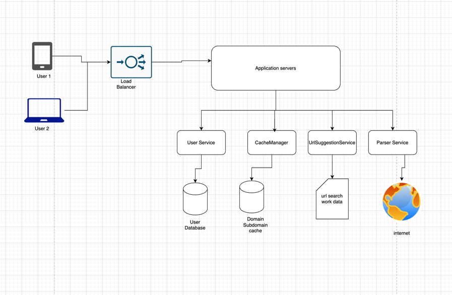

# Web Crawler Application

A scalable web crawler built with Spring Boot that crawls websites and tracks visited URLs per user.

# Functional Requirements

1. **URL Search** – Allow users to input and search URLs.
2. **Domain Validation** – Verify if the given domain is valid and reachable.
3. **Search Suggestions** – Suggest similar or related URLs during search input.
4. **Page Parsing** – Parse web pages and extract subdomains.
5. **Cache Check** – Before parsing, check if domain data exists in cache (e.g., Redis).
6. **Visited Tracking** – Maintain a list of subdomains visited by each user.
7. **Update Visits** – Mark subdomains as visited when clicked, storing timestamp.
8. **Subdomain Filtering** – Remove or ignore invalid/non-child subdomains.
9. **User Data Storage** – Securely store user information and interaction history.
10. **Concurrent Parsing** – Support parallel webpage parsing for performance.

# Non-Functional Requirements

1. **Performance** – Efficiently crawl and process pages with low latency.
2. **Scalability** – Handle large sub-URL volumes and multiple concurrent users.
3. **Consistency** – Maintain accurate and ordered sub-URL results.
4. **Availability** – Ensure high uptime and continuous system operation.
5. **Reliability** – Deliver correct results under varying load conditions.
7. **Durability** – Persist critical data (users, cache, visited URLs) reliably.
8. **Microservices Architecture** – Use separate services (e.g., validator, crawler, cache).
9. **Load Balancing** – Distribute traffic evenly across system instances.

## High level Overview

## Features

- **Multi-Strategy Crawling**: BFS, DFS, and Concurrent parsing strategies
- **Multi-Format Support**: HTML and JSON parsers (extensible)
- **User-Specific Tracking**: Track which URLs each user has visited
- **In-Memory Caching**: Fast URL lookup with nested structure caching
- **LRU Cache Eviction**: Configurable cache size with LRU policy
- **Internal Link Filtering**: Only crawls links within the same domain
- **Configurable Depth**: Crawl with unlimited or specified depth levels
- **Retry Logic**: Automatic retry with exponential backoff for timeouts
- **Structured Logging**: SLF4J-based logging throughout

## Tech Stack

- **Java 21**
- **Spring Boot 3.5.7**
- **Maven** (wrapper included)
- **Jsoup** (HTML parsing)
- **Lombok** (boilerplate reduction)
- **SLF4J** (logging)

## Architecture

### Design Patterns

1. **Singleton Pattern**: In-memory cache manager
2. **Strategy Pattern**: Pluggable parsing strategies (BFS/DFS/Concurrent) and Caching strategies like LRU, LFU
2. **Factory Pattern**: Parser creation based on content type
3. **Template Method**: Abstract Parser with concrete implementations

### Project Structure

```
src/main/java/com/example/monzobank/
├── WebCrawlerApplication.java        # Main entry point
├── controller/
│   └── UserController.java           # REST API endpoints
├── service/
│   ├── UserService.java              # User business logic
│   ├── UrlSearchService.java         # URL crawling orchestration
│   ├── UrlCacheManager.java          # In-memory cache
│   ├── UrlValidatorService.java      # URL validation utilities
│   └── Parser/
│       ├── Parser.java                # Abstract parser
│       ├── HtmlParser.java            # HTML parsing implementation
│       ├── JsonParser.java            # JSON parsing (stub)
│       ├── ParseFactory.java          # Parser factory
│       └── parsingStrategy/
│           ├── ParsingStrategy.java   # Strategy interface
│           ├── BFSParsingStrategy.java # Breadth-first crawling
│           ├── DFSParsingStrategy.java # Depth-first crawling
│           └── ConcurrentParsingStrategy.java # Parallel crawling
├── repository/
│   └── UserRepository.java           # In-memory user storage
├── entities/
│   ├── User.java                     # User entity
│   └── Url.java                      # URL entity with nested children
├── model/
│   ├── CrawlResponseModel.java       # API response model
│   └── UrlVistedModel.java           # URL with visit status
└── mapper/
    └── ChildUrlResponseMapper.java   # Entity to DTO mapper
```

## API Endpoints

### 1. Get Child URLs
Crawls a URL and returns all child URLs with visit status for the user.

**Endpoint:** `GET /webCrawl/getChildUrls`

**Parameters:**
- `url` (required): URL to crawl (e.g., `https://www.iana.org/`)
- `userEmail` (required): User email (e.g., `aakash@gmail.com`)

**Example:**
```bash
curl "http://localhost:8080/webCrawl/getChildUrls?url=https://www.iana.org/&userEmail=aakash@gmail.com"
```

**Response:**
```json
{
  "url": "https://www.iana.org/",
  "childUrls": [
    {
      "url": "https://www.iana.org/protocols",
      "visited": true,
      "lastAccessTime": "2024-06-01T10:00:00"
    },
    {
      "url": "https://www.iana.org/domains",
      "visited": false,
      "lastAccessTime": null
    }
  ],
  "user": {
    "email": "aakash@gmail.com"
  }
}
```

### 2. Mark URL as Visited
Records that a user has visited a specific URL.

**Endpoint:** `POST /webCrawl/visitUrl`

**Parameters:**
- `parentUrl` (required): Parent URL
- `childUrl` (required): Child URL that was visited
- `userEmail` (required): User email

**Example:**
```bash
curl -X POST "http://localhost:8080/webCrawl/visitUrl?parentUrl=https://www.iana.org/&childUrl=https://www.iana.org/protocols&userEmail=aakash@gmail.com"
```

**Response:**
```json
true
```

## Test Users

The application comes with 3 pre-configured test users:

| Email             | Visited URLs                                 |
|-------------------|----------------------------------------------|
| aakash@gmail.com  | IANA protocols, domains; Google search, maps |
| karan@example.com | null                                         |
| aayush@test.com   | GitHub explore                               |

## Cached URLs

Pre-cached for testing:
- `https://www.google.com/` with child URLs (search, maps, images, news)

## Running the Application

### Prerequisites
- Java 21 or higher
- Maven (or use included wrapper)

### Build and Run

```bash
 Maven
mvn clean install
mvn spring-boot:run
```

The application will start on `http://localhost:8080`

### Test the API

```bash
# Test with cached Google URL (instant response)
curl "http://localhost:8080/webCrawl/getChildUrls?url=https://www.google.com/&userEmail=aakash@gmail.com"

# Test with new URL (will crawl)
curl --location 'http://localhost:8080/webCrawl/getChildUrls?url=https%3A%2F%2Fwww.iana.org%2F&userEmail=aakash%40gmail.com'

# Mark URL as visited
curl --location --request POST 'http://localhost:8080/webCrawl/visitUrl?parentUrl=https%3A%2F%2Fwww.iana.org%2F&childUrl=https%3A%2F%2Fwww.iana.org%2Fabuse&userEmail=aakash%40gmail.com'
```

## Configuration

### Parsing Strategy
Change strategy in `UrlSearchService.java`:

```java
// BFS (default)
Parser parser = ParseFactory.getParser("html", new BFSParsingStrategy());

// DFS
Parser parser = ParseFactory.getParser("html", new DFSParsingStrategy());
```

### Crawl Depth
```java
// Unlimited depth
// overloaded function
Url result = parser.parse(url);

// Limited depth
Url result = parser.parse(url, 2); // 2 levels deep
```

### Limits
Configured in parsing strategies:
- `MAX_LINKS = 50` - Maximum URLs to crawl
- `TIMEOUT_MS = 20000` - HTTP connection timeout (20s)
- `MAX_RETRIES = 3` - Retry attempts on timeout


## Future Enhancements

- [ ] DFS parsing strategy implementation both concurrent and sequential
- [ ] Add Redis for distributed caching
- [ ] Implement Elasticsearch for URL search
- [ ] Add rate limiting
- [ ] Implement concurrent strategy
- [ ] Add URL deduplication
- [ ] Support robots.txt
- [ ] Add metrics and monitoring
- [ ] Implement pagination for large result sets
- [ ] Add authentication/authorization
- [ ] Dockerize the application
- [ ] LRU/LFU cache strategy selection
- [ ] Add more parsers (XML, PDF, etc.)
- [ ] Implement a web UI for easier interaction

